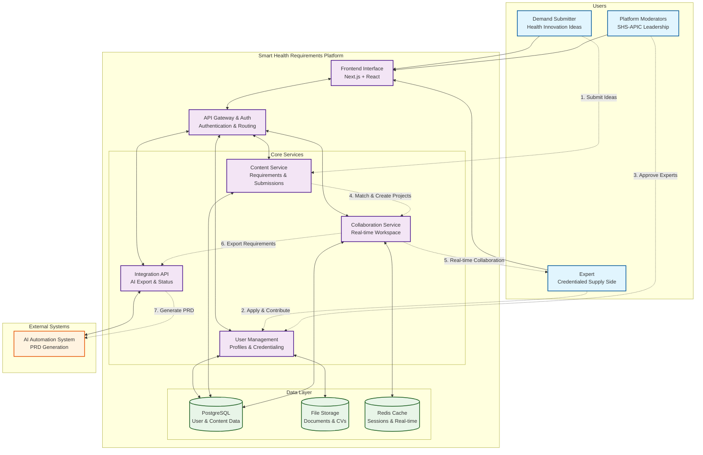

# Smart Health Requirements Gathering Platform


> **Empowering health innovation through structured collaboration between demand-side ideas and expert-driven requirement gathering**

A collaborative platform developed by Smart Health Society APIC that transforms health innovation ideas into comprehensive, AI-ready Product Requirements Documents (PRDs) through expert consultation and structured requirement gathering.

## 🌟 Overview

The Smart Health Requirements Gathering Platform bridges the gap between health innovation ideas and actionable implementation by facilitating structured collaboration between:

- **Demand Side**: Healthcare professionals, administrators, and innovators with ideas
- **Supply Side**: Credentialed health experts providing consultation and guidance
- **AI Integration**: Automated PRD generation from collected requirements

### Key Value Proposition

✅ **Structured Requirement Gathering** - Transform vague ideas into detailed specifications  
✅ **Expert Network** - Connect with credentialed health professionals  
✅ **Real-time Collaboration** - Work together in shared digital workspaces  
✅ **AI-Ready Output** - Generate professional PRDs automatically  
✅ **Health-Focused** - Built specifically for Indonesian health innovation context

## 🏗️ Architecture Overview



## 🚀 Platform Workflow

### 1. **Submit Ideas** 💡
Demand submitters submit health innovation ideas through structured forms

### 2. **Apply & Contribute** 👨‍⚕️
Experts apply with credentials and contribute domain expertise

### 3. **Approve Experts** ✅
Moderators review and approve expert credentials

### 4. **Match & Create Projects** 🤝
AI-powered matching creates collaborative project workspaces

### 5. **Real-time Collaboration** 🔄
Teams work together to develop comprehensive requirements

### 6. **Export Requirements** 📤
Completed requirements are validated and exported

### 7. **Generate PRD** 📋
AI automation creates professional Product Requirements Documents

## 🛠️ Tech Stack

### Frontend
- **Framework**: Next.js 14+ with App Router
- **UI Library**: React 18+ with TypeScript
- **Styling**: Tailwind CSS + Shadcn/ui
- **State Management**: Zustand + React Query
- **Real-time**: Socket.IO client

### Backend
- **Runtime**: Node.js 20+
- **Framework**: Express.js with TypeScript
- **Database**: PostgreSQL 15+ with Prisma ORM
- **Authentication**: NextAuth.js
- **File Storage**: AWS S3 compatible
- **Cache**: Redis for sessions and real-time data

### Infrastructure
- **Deployment**: Vercel (Frontend) + AWS/DigitalOcean (Backend)
- **Database**: Managed PostgreSQL (AWS RDS/Supabase)
- **Monitoring**: Application performance monitoring
- **Security**: SSL/TLS encryption, input validation

## 📋 Features

### 🎯 Core Features

#### **Demand Submission System**
- Guided idea submission with health-specific templates
- Auto-categorization by health domains
- Rich text editing with media upload
- Draft management and version control

#### **Expert Credentialing**
- CV upload and verification system
- Leadership approval workflows
- Professional profile management
- Expertise matching algorithms

#### **Real-time Collaboration**
- Shared project workspaces
- Live collaborative editing
- Comment and suggestion systems
- Visual collaboration tools (diagrams, mind maps)

#### **AI Integration**
- Structured data export for AI processing
- Quality validation before handoff
- Status tracking and notifications
- Webhook integration for external systems

### 🔧 Advanced Features

- **Project Management**: Milestone tracking and progress monitoring
- **Analytics Dashboard**: Platform usage and success metrics
- **Security**: Role-based access control and data encryption
- **Scalability**: Microservices architecture supporting 1000+ users
- **Mobile Support**: Responsive design for all devices

## 🚀 Quick Start

### Prerequisites

- Node.js 20+
- PostgreSQL 15+
- Redis 6+
- AWS S3 or compatible storage

### Installation

1. **Clone the repository**
```bash
git clone https://github.com/shs-apic/smart-health-requirements-platform.git
cd smart-health-requirements-platform
```

2. **Install dependencies**
```bash
# Install frontend dependencies
cd frontend
npm install

# Install backend dependencies
cd ../backend
npm install
```

3. **Environment setup**
```bash
# Copy environment templates
cp .env.example .env.local
cp backend/.env.example backend/.env

# Configure your environment variables
# - Database connection
# - Redis connection
# - AWS S3 credentials
# - Authentication secrets
```

4. **Database setup**
```bash
cd backend
npx prisma migrate dev
npx prisma db seed
```

5. **Start development servers**
```bash
# Terminal 1: Backend
cd backend
npm run dev

# Terminal 2: Frontend
cd frontend
npm run dev

# Terminal 3: Redis (if running locally)
redis-server
```

6. **Access the platform**
- Frontend: http://localhost:3000
- Backend API: http://localhost:8000
- API Documentation: http://localhost:8000/docs

### Docker Setup (Alternative)

```bash
# Clone and navigate
git clone https://github.com/shs-apic/smart-health-requirements-platform.git
cd smart-health-requirements-platform

# Start with Docker Compose
docker-compose up -d

# The platform will be available at http://localhost:3000
```

## 📖 Documentation

| Document | Description |
|----------|-------------|
| [Architecture Guide](./docs/architecture.md) | Detailed technical architecture |
| [API Documentation](./docs/api.md) | REST API endpoints and schemas |
| [Deployment Guide](./docs/deployment.md) | Production deployment instructions |
| [User Guide](./docs/user-guide.md) | End-user documentation |
| [Developer Guide](./docs/developer-guide.md) | Contributing and development setup |
| [Security Guide](./docs/security.md) | Security implementation details |

## 👥 User Roles

### **Demand Submitters** 🏥
Healthcare professionals, administrators, researchers, and entrepreneurs who:
- Submit health innovation ideas
- Participate in requirement gathering
- Collaborate with matched experts
- Receive AI-generated PRDs

### **Credentialed Experts** 👨‍⚕️
Medical professionals, health tech specialists, policy experts who:
- Apply for platform credentials
- Provide domain expertise
- Guide requirement development
- Ensure solution feasibility

### **Platform Moderators** 👑
SHS-APIC leadership members who:
- Approve expert credentials
- Monitor platform quality
- Provide strategic guidance
- Oversee platform governance

## 🎯 Success Metrics

### Platform Goals
- **90%** requirement completeness rate for AI processing
- **80%** expert engagement within first 3 months
- **85%** demand satisfaction with expert input
- **95%** successful AI integration handoffs
- **200+** credentialed experts by month 6
- **500+** demand submissions by month 6

### Quality Standards
- **Performance**: <2s page load times, <100ms collaboration latency
- **Reliability**: 99.5% uptime with robust error handling
- **Security**: End-to-end encryption with secure authentication
- **Accessibility**: WCAG 2.1 AA compliance

## 🗺️ Roadmap

### Phase 1: Foundation (Months 1-2) ✅
- [x] Platform infrastructure setup
- [x] User authentication and profiles
- [x] Basic demand submission system
- [x] Expert credentialing workflow

### Phase 2: Collaboration (Months 3-4) 🚧
- [ ] Real-time collaborative editing
- [ ] Project workspace management
- [ ] Expert matching algorithms
- [ ] Visual collaboration tools

### Phase 3: AI Integration (Months 5-6) 📋
- [ ] Structured data export API
- [ ] AI automation integration
- [ ] Quality validation systems
- [ ] Production deployment

### Future Enhancements 🔮
- Mobile applications for improved accessibility
- Advanced analytics and insights
- Multi-language support for regional expansion
- Integration marketplace for implementation services
- AI-assisted requirement gathering

## 🤝 Contributing

We welcome contributions from the health tech community! Please see our [Contributing Guide](./CONTRIBUTING.md) for details.

### Development Process
1. Fork the repository
2. Create a feature branch (`git checkout -b feature/amazing-feature`)
3. Commit your changes (`git commit -m 'Add amazing feature'`)
4. Push to the branch (`git push origin feature/amazing-feature`)
5. Open a Pull Request

### Code Standards
- TypeScript for type safety
- ESLint + Prettier for code formatting
- Jest for unit testing
- Cypress for end-to-end testing
- Conventional commits for version control

## 📊 Project Status

| Component | Status | Coverage |
|-----------|--------|----------|
| Frontend | 🚧 Development | 60% |
| Backend API | 🚧 Development | 75% |
| Database | ✅ Complete | 100% |
| Authentication | ✅ Complete | 95% |
| Real-time Features | 📋 Planned | 0% |
| AI Integration | 📋 Planned | 0% |

## 📄 License

This project is licensed under the GNU Affero General Public License v3.0 (AGPL-3.0) - see the [LICENSE](./LICENSE) file for details.

### Why AGPL-3.0?
- Ensures platform remains open source
- Protects community contributions
- Requires source disclosure for network use
- Promotes transparency in health innovation

## 🙏 Acknowledgments

- **Smart Health Society APIC** - Project leadership and vision
- **Indonesian Health Innovation Community** - Domain expertise and guidance
- **Open Source Contributors** - Technical development and support

## 🆘 Support

### Community Support
- **GitHub Discussions**: Ask questions and share ideas
- **Documentation**: Comprehensive guides and tutorials
- **Issue Tracker**: Report bugs and request features

### Professional Support
- **SHS-APIC Members**: Priority support for community members
- **Implementation Services**: Professional deployment assistance
- **Training Workshops**: Platform adoption and best practices

### Contact Information

| Contact Type | Details |
|--------------|---------|
| **Project Lead** | Smart Health Society APIC Leadership |
| **Technical Support** | [GitHub Issues](https://github.com/shs-apic/smart-health-requirements-platform/issues) |
| **Community** | [GitHub Discussions](https://github.com/shs-apic/smart-health-requirements-platform/discussions) |
| **Security Issues** | security@shs-apic.org |

---

**Made with ❤️ by Smart Health Society APIC for the Indonesian health innovation community**

*Transforming health ideas into actionable solutions through collaborative expertise*
